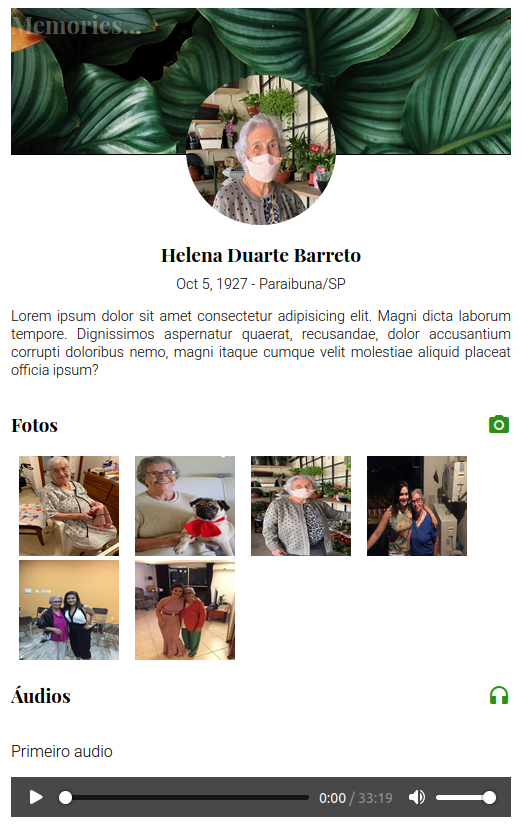

# Memories client

This is just a simple app built from the standard `ng new` command. It is supposed to be a more personal social media profile, and it is intended to honor my SO's grandmother, who is 94 years old as I write this. The main idea is that all her family members will be able to upload pictures, audio recordings and messages about their matriarch, and have access to this kind of content anywhere and anytime. This might be a modern version of keeping pictures in our wallet :).

This was written in plain Angular (so Typescript) and plain CSS for simplicity. An Nginx Docker image is being used to serve the built (`ng build`) application and to proxy the requests to the server.

